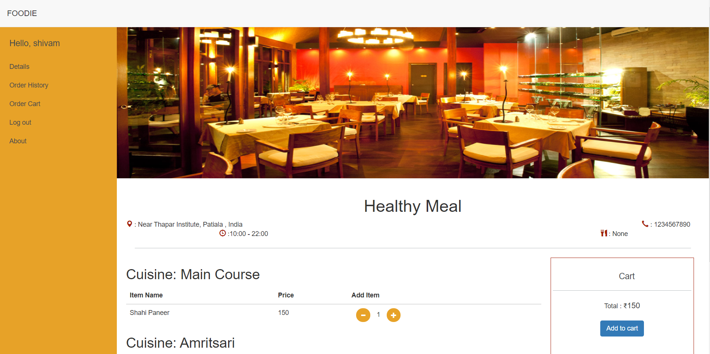

## FOODIE - Online Food Ordering System

<h1 align="center">
	
</h1>

Software Engineering Project using Django Web Development Framework. | Made in T.I.E.T.

__Order Something !__



To run the website on you local system:

Install Requirements:
```
pip install requirements.txt
```

Run Server in your Local Machine:
```
python manage.py runserver
```